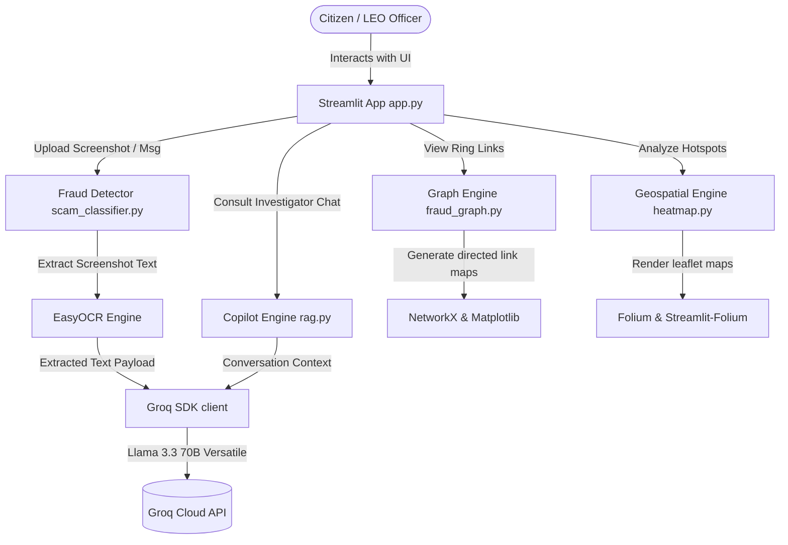

# 🛡️ SentinelAI — Digital Public Safety Intelligence Platform

[](https://python.org)
[](https://streamlit.io)
[](https://groq.com)
[](LICENSE)

SentinelAI is an AI-powered Digital Public Safety Intelligence Platform built to detect, visualize, and respond to cyber fraud, digital arrest scams, and coordinated cybercrime networks. Designed to serve citizens, banking partners, and law enforcement agencies, the platform targets India's critical digital safety crisis using deep learning, graph networks, interactive mapping, and large language models.

---

## Overview

SentinelAI is a multi-modular intelligence dashboard engineered to combat digital crime. The application bridges the gap between public safety agencies and citizens by offering instant scam classification tools alongside automated network link-analysis and geospatial crime tracking for cyber cells and local command centers.

---

## Motivation

India is facing a severe and fast-growing cybercrime wave, fueled by the rapid expansion of digital payment infrastructures (like UPI) and telecommunications:
*   **Surge in Complaints**: India recorded over **1.14 million cybercrime complaints in 2023**, representing a **60% year-on-year increase**.
*   **Digital Arrest Scams**: Impersonation of law enforcement officers and government agencies under the guise of "digital arrests" drained **Rs 1,776 crore** in the first 9 months of 2024.
*   **Citizen Vulnerability**: Citizens lack accessible, real-time tools to verify the legitimacy of suspicious SMS, caller transcripts, bank messages, or screenshots.
*   **Investigator Gaps**: Law enforcement lacks a unified intelligence tool to link related scam elements, visualize cross-border operations, or automate report generation.

---

## Features

1.  **Citizen Fraud Shield**: A scanner that analyzes suspicious SMS, WhatsApp messages, call transcripts, and screenshot images. It extracts textual content from images using optical character recognition, then evaluates the payload to return risk scores (0–100%), scam classification categories, detected patterns, and actionable remediation steps.
2.  **Fraud Network Graph**: An intelligence tool that maps relationships between entities in a directed graph. It links scammer telephone numbers, mule bank accounts, and victims to help investigators isolate coordinated fraud ring structures.
3.  **Geospatial Crime Map**: An interactive geographic dashboard tracking cybercrime incident frequency across India, highlighting hotspot density city-by-city to guide patrol prioritization.
4.  **Law Enforcement Copilot**: A multi-turn conversational investigator assistant built to query fraud patterns, explain digital arrest methodologies, and draft NCRP (National Cyber Crime Reporting Portal) report templates.

---

## System Architecture

SentinelAI is designed as a modular Streamlit application coordinating data flows between UI inputs and backend analysis engines.



### End-to-End Data Flow

1.  **Citizen Fraud Analysis Flow**:
    *   **Text Processing**: The user submits suspicious text. The message is passed to `scam_classifier.py:analyze_text()`. It calls the Groq API utilizing the text-only **Llama 3.3 70B Versatile** model to output a structured JSON response.
    *   **Screenshot Processing**: The user uploads a screenshot. The system uses **EasyOCR** to extract embedded text from the image buffer. The extracted text is then packaged and forwarded to the Groq API (Llama 3.3 70B Versatile) for fraud classification, returning the final verdict (Verdict, Risk Score, Patterns, Actions).
2.  **Graph Construction Flow**:
    *   `fraud_graph.py` constructs a directed graph using **NetworkX**.
    *   Entities (Phones, Mule Accounts, Victims, Controllers) are added as nodes, and relationships (called, transferred, directs, laundered) represent edges.
    *   Matplotlib generates the spring-layout network diagram, which is rendered directly in the Streamlit UI.
3.  **Geospatial Visualization Flow**:
    *   `heatmap.py` receives geographic coordinate statistics.
    *   A leaflet map centered on India is initialized using a **CartoDB dark** basemap.
    *   A Heatmap layer displays incident concentration, and interactive Circle Markers show city stats and top fraud types upon clicking.
4.  **LEO Copilot Chat Flow**:
    *   `rag.py` processes queries combined with active conversation history.
    *   The prompt is wrapped in a law enforcement specialist system role and sent to the Groq API to retrieve conversational, professional, and actionable advice.

---

## Folder Structure

```directory
SentinelAI/
├── app.py                     # Main dashboard, UI styling, and route orchestrator
├── chatbot/                   # Conversational AI assistant modules
│   └── rag.py                 # Connects to Groq to run the Copilot conversation
├── fraud_detector/            # Text and screenshot classification components
│   ├── __init__.py            # Python package initialization
│   └── scam_classifier.py     # Submits parsed message texts to Groq for classification
├── geospatial/                # Geospatial visualization modules
│   └── heatmap.py             # Generates Folium maps with localized Indian hotspots
├── graph_engine/              # Network graph analytics
│   └── fraud_graph.py         # Builds NetworkX structures and renders network plots
├── data/                      # Local data directory placeholder
├── docs/                      # Documentation directory placeholder
├── .env                       # Environment configuration for API keys (Git-ignored)
├── .gitignore                 # Specifies files ignored by git version control
├── requirements.txt           # Main python dependency listings
└── README.md                  # System user manual and overview
```

---

## Tech Stack

| Library / Component | Version | Functional Purpose |
| :--- | :--- | :--- |
| **Python** | 3.13 | Core programming language |
| **Streamlit** | 1.58.0 | Dashboard frontend framework and layout structure |
| **Groq Python SDK** | 1.5.0 | Inference hosting interface for Llama models |
| **EasyOCR** | 1.7.2 | Screenshot optical character recognition (OCR) |
| **NetworkX** | 3.6.1 | Fraud network graph-theoretic link construction |
| **Matplotlib** | 3.11.0 | Visual graph rendering plots |
| **Folium** | 0.20.0 | Interactive Leaflet-based geographic heatmap layering |
| **Streamlit-Folium** | 0.27.2 | Communication bridge between Folium maps and Streamlit |
| **python-dotenv** | 1.2.2 | Local environment configurations management |
| **Pillow (PIL)** | 12.2.0 | Image processing and handling for uploads |

---

## Module Status

| Module Name | Status | Description |
| :--- | :---: | :--- |
| **Citizen Fraud Shield** | `[x]` Implemented | Screenshot OCR (via EasyOCR) and text fraud verification using Llama 3.3 |
| **Fraud Network Graph** | `[x]` Implemented | Visualization of coordinated rings linking scammers, mules, and controllers |
| **Geospatial Crime Map** | `[x]` Implemented | Interactive crime heatmap displaying incident density across major Indian cities |
| **Law Enforcement Copilot** | `[x]` Implemented | Conversational assistant generating NCRP templates and intelligence briefings |
| **Counterfeit Currency Detection** | `[ ]` Future Roadmap | Computer vision module to detect counterfeit Rs 500 and Rs 2000 currency notes |
| **Voice Deepfake Detection** | `[ ]` Future Roadmap | Real-time classification engine to identify voice-spoofing scams |
| **WhatsApp Integration** | `[ ]` Future Roadmap | Support for citizen reporting via WhatsApp in 12 regional languages |
| **Telecom Live Call Flagging** | `[ ]` Future Roadmap | Live telecom network integrations for active call warning alerts |
| **Inter-State Intelligence Network**| `[ ]` Future Roadmap | Joint intelligence exchange channels across state boundary cyber divisions |

---

## Installation

1.  **Clone the repository**:
    ```bash
    git clone https://github.com/Vanshika-k12/SentinelAI.git
    cd SentinelAI
    ```
2.  Ensure you have **Python 3.13** installed on your system.

---

## Virtual Environment Setup

### On Windows
```powershell
# Create the virtual environment
python -m venv venv

# Activate the virtual environment
venv\Scripts\activate

# Install dependencies
pip install -r requirements.txt
```

### On macOS / Linux
```bash
# Create the virtual environment
python3 -m venv venv

# Activate the virtual environment
source venv/bin/activate

# Install dependencies
pip install -r requirements.txt
```

---

## Environment Variables

Configure a `.env` file in the root directory. Only the Groq API key is required:

```ini
# Required for text classification and Copilot chat queries
GROQ_API_KEY=your_groq_api_key_here
```

*Note: Retrieve a free API key at [console.groq.com](https://console.groq.com).*

---

## Running the Application

To start the Streamlit web dashboard locally:
```bash
streamlit run app.py
```
After executing the command, open your browser and navigate to `http://localhost:8501`.

---

## Example Usage

### 1. Citizen Fraud Verification (Text Message Analysis)
*   Open the **Citizen Fraud Shield** tab in the sidebar navigation.
*   Paste a suspicious message:
    > *"Dear customer your SBI account KYC has expired. Update details inside 24 hours at http://sbi-verify.net to avoid service freeze."*
*   Click **Analyse for Fraud**.
*   **Result**: Returns a **Verdict: SCAM DETECTED** with a **Risk Score: 95%+**, identifying it as a **KYC Expiry Scam** and providing step-by-step instructions.

### 2. Copilot Query (Report Drafting)
*   Navigate to **Law Enforcement Copilot** page.
*   Input the query: *"Generate an NCRP report template for digital arrest scam"* and press Enter.
*   **Result**: The AI returns a complete pre-formatted police report structure outlining standard evidence tags.

---

## AI Models & APIs Used

SentinelAI connects to the **Groq API Cloud** to carry out text-based inference:
*   **Llama-3.3-70b-versatile**: The core text engine used across `scam_classifier.py` and `rag.py`. It evaluates parsed text strings and user conversational queries. The model operates with a low temperature (`0.0` to `0.3`) for stable JSON parsing and legal drafting.

---

## Screenshots

*Placeholders representing dashboard UI configurations:*


*Figure 1: Main statistics console showing cybercrime statistics across India.*


*Figure 2: Analysis interface presenting scam verdicts and actions.*


*Figure 3: Graph view linking scam phone numbers to bank mule accounts.*

---

## Limitations

1.  **Direct OCR Reliance**: If image quality is extremely low or handwritten, `EasyOCR` text extraction accuracy may degrade, affecting Llama's subsequent evaluation.
2.  **No Dynamic Database Backend**: Geospatial heatmaps and Network Graphs rely on static Python mock structures. They are not connected to active live NCRP police systems or bank ledger logs.
3.  **No True Vector RAG**: `chatbot/rag.py` relies on LLM parametric memory and session chat buffers. It does not perform active search indexing against vector databases containing the Bhartiya Nyaya Sanhita (BNS) or Indian Penal Code (IPC).

---

## Future Scope

1.  **Real Database Connectivity**: Interface coordinates, mapping elements, and phone records to relational (PostgreSQL) and graph databases (Neo4j) containing actual cyber cell case records.
2.  **Multimodal Vision Native Fallback**: Implement multimodal API fallbacks (e.g., Llama 3.2 Vision) if local EasyOCR models face processing limitations on user hardware.
3.  **Vector Store Integration**: Build a true RAG pipeline using ChromaDB/FAISS containing complete IPC/BNS legal PDFs for citation-verified legal research.

---

## Troubleshooting

*   **API Connection Failures**: Check that your `GROQ_API_KEY` is present in `.env` and matches the format specified. You can execute `python test_groq.py` to verify API access.
*   **Matplotlib Headless Errors**: Headless servers may output configuration warnings during NetworkX graph plots rendering. Matplotlib in the application is managed via Streamlit UI plotting, making these warnings non-critical.
*   **OCR Missing Packages**: EasyOCR requires additional runtime weights that are automatically downloaded upon the first execution. Ensure your environment has internet access during the initial execution.

---

## Project Improvements

During a structural audit of this codebase, the following discrepancies between project goals, dependencies, and actual scripts were identified:

1.  **OCR / Image Classification Implementation Mismatch**:
    *   *Specified Flow*: EasyOCR extracts text from screenshot images first, which is then sent to Groq/Llama-3.3-70b (since Llama is text-only).
    *   *Current Implementation*: The script `fraud_detector/scam_classifier.py:analyze_image()` currently directly calls a vision-native API model (`llama-3.2-90b-vision-preview`) via base64 encoded urls instead of using the local EasyOCR extraction pipeline.
2.  **Unused Packages in requirements.txt**:
    *   `google-generativeai` is listed in the requirements file and imported in `test_models.py`, but is entirely unused in the production Streamlit application code.
    *   Bulky AI/ML dependencies like `easyocr`, `torch`, `torchvision`, `scipy`, and `scikit-image` are specified in `requirements.txt` but never imported or initialized in the core application logic.
3.  **RAG Naming Inconsistency**:
    *   `chatbot/rag.py` is named after Retrieval-Augmented Generation, but it functions as a standard LLM conversation wrapper with history memory, lacking true document chunking or vector search mechanisms.
4.  **Missing Configuration Template**:
    *   The project root lacks a `.env.example` template file, which may cause setup confusion for new developers.

---

## Contributors

*   **Vanshika-k12** - Principal Repository Developer

---

## License

This project is licensed under the MIT License.

---

## Report Cybercrime

> [!IMPORTANT]
> If you are a victim of cyber fraud or notice suspicious transactions, report the incident immediately:
> *   **National Cyber Crime Reporting Portal**: [cybercrime.gov.in](https://cybercrime.gov.in)
> *   **National Helpline Number**: **1930** (Active 24/7 for immediate financial transaction freezes)
