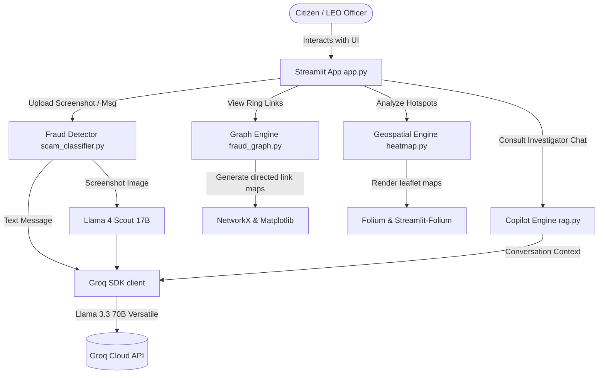

# 🛡️ SentinelAI — Digital Public Safety Intelligence Platform

[](https://python.org)
[](https://streamlit.io)
[](https://groq.com)
[](LICENSE)

SentinelAI is an AI-powered Digital Public Safety Intelligence Platform built to detect, visualize, and respond to cyber fraud, digital arrest scams, and coordinated cybercrime networks. Designed to serve citizens, banking partners, and law enforcement agencies, the platform targets India's critical digital safety crisis using deep learning, graph networks, interactive mapping, and large language models.

---

## Overview

SentinelAI is a multi-modular intelligence dashboard engineered to combat digital crime. The application bridges the gap between public safety agencies and citizens by offering instant scam classification tools alongside automated network link-analysis and geospatial crime tracking for cyber cells and local command centers.

---

## Motivation

India is facing a severe and fast-growing cybercrime wave, fueled by the rapid expansion of digital payment infrastructures (like UPI) and telecommunications:
*   **Surge in Complaints**: India recorded over **1.14 million cybercrime complaints in 2023**, representing a **60% year-on-year increase**.
*   **Digital Arrest Scams**: Impersonation of law enforcement officers and government agencies under the guise of "digital arrests" drained **Rs 1,776 crore** in the first 9 months of 2024.
*   **Citizen Vulnerability**: Citizens lack accessible, real-time tools to verify the legitimacy of suspicious SMS, caller transcripts, bank messages, or screenshots.
*   **Investigator Gaps**: Law enforcement lacks a unified intelligence tool to link related scam elements, visualize cross-border operations, or automate report generation.

---

## Features

1.  **Citizen Fraud Shield**: A scanner that analyzes suspicious SMS, WhatsApp messages, call transcripts, and screenshot images. It extracts textual content from images using optical character recognition, then evaluates the payload to return risk scores (0–100%), scam classification categories, detected patterns, and actionable remediation steps.
2.  **Fraud Network Graph**: An intelligence tool that maps relationships between entities in a directed graph. It links scammer telephone numbers, mule bank accounts, and victims to help investigators isolate coordinated fraud ring structures.
3.  **Geospatial Crime Map**: An interactive geographic dashboard tracking cybercrime incident frequency across India, highlighting hotspot density city-by-city to guide patrol prioritization.
4.  **Law Enforcement Copilot**: A multi-turn conversational investigator assistant built to query fraud patterns, explain digital arrest methodologies, and draft NCRP (National Cyber Crime Reporting Portal) report templates.

---

## System Architecture

SentinelAI is designed as a modular Streamlit application coordinating data flows between UI inputs and backend analysis engines.



### End-to-End Data Flow

1.  **Citizen Fraud Analysis Flow**:
    *   **Text Processing**: The user submits suspicious text. The message is passed to `scam_classifier.py:analyze_text()`. It calls the Groq API utilizing the text-only **Llama 3.3 70B Versatile** model to output a structured JSON response.
    *   **Screenshot Processing**: The user uploads a screenshot. Screenshots are sent directly to Llama 3.2 90B Vision via Groq API, which natively understands image content without requiring OCR preprocessing.
    (Verdict, Risk Score, Patterns, Actions).
2.  **Graph Construction Flow**:
    *   `fraud_graph.py` constructs a directed graph using **NetworkX**.
    *   Entities (Phones, Mule Accounts, Victims, Controllers) are added as nodes, and relationships (called, transferred, directs, laundered) represent edges.
    *   Matplotlib generates the spring-layout network diagram, which is rendered directly in the Streamlit UI.
3.  **Geospatial Visualization Flow**:
    *   `heatmap.py` receives geographic coordinate statistics.
    *   A leaflet map centered on India is initialized using a **CartoDB dark** basemap.
    *   A Heatmap layer displays incident concentration, and interactive Circle Markers show city stats and top fraud types upon clicking.
4.  **LEO Copilot Chat Flow**:
    *   `rag.py` processes queries combined with active conversation history.
    *   The prompt is wrapped in a law enforcement specialist system role and sent to the Groq API to retrieve conversational, professional, and actionable advice.

---

## Folder Structure

```directory
SentinelAI/
├── app.py                     # Main dashboard, UI styling, and route orchestrator
├── chatbot/                   # Conversational AI assistant modules
│   └── rag.py                 # Connects to Groq to run the Copilot conversation
├── fraud_detector/            # Text and screenshot classification components
│   ├── __init__.py            # Python package initialization
│   └── scam_classifier.py     # Submits parsed message texts to Groq for classification
├── geospatial/                # Geospatial visualization modules
│   └── heatmap.py             # Generates Folium maps with localized Indian hotspots
├── graph_engine/              # Network graph analytics
│   └── fraud_graph.py         # Builds NetworkX structures and renders network plots
├── data/                      # Local data directory placeholder
├── docs/                      # Documentation directory placeholder
├── .env                       # Environment configuration for API keys (Git-ignored)
├── .gitignore                 # Specifies files ignored by git version control
├── requirements.txt           # Main python dependency listings
└── README.md                  # System user manual and overview
```

---

## Tech Stack

| Library / Component | Version | Functional Purpose |
| :--- | :--- | :--- |
| **Python** | 3.13 | Core programming language |
| **Streamlit** | 1.58.0 | Dashboard frontend framework and layout structure |
| **Groq Python SDK** | 1.5.0 | Inference hosting interface for Llama models |
| **Llama 4 Scout (17B)** | via Groq | Direct screenshot image understanding |
| **NetworkX** | 3.6.1 | Fraud network graph-theoretic link construction |
| **Matplotlib** | 3.11.0 | Visual graph rendering plots |
| **Folium** | 0.20.0 | Interactive Leaflet-based geographic heatmap layering |
| **Streamlit-Folium** | 0.27.2 | Communication bridge between Folium maps and Streamlit |
| **python-dotenv** | 1.2.2 | Local environment configurations management |
| **Pillow (PIL)** | 12.2.0 | Image processing and handling for uploads |

---

## Module Status

| Module Name | Status | Description |
| :--- | :---: | :--- |
| **Citizen Fraud Shield** | `[x]` Implemented | Text analysis via Llama 3.3 70B + screenshot analysis via Llama 4 Scout (17B), both through Groq |
| **Fraud Network Graph** | `[x]` Implemented | Visualization of coordinated rings linking scammers, mules, and controllers |
| **Geospatial Crime Map** | `[x]` Implemented | Interactive crime heatmap displaying incident density across major Indian cities |
| **Law Enforcement Copilot** | `[x]` Implemented | Conversational assistant generating NCRP templates and intelligence briefings |
| **Counterfeit Currency Detection** | `[ ]` Future Roadmap | Computer vision module to detect counterfeit Rs 500 and Rs 2000 currency notes |
| **Voice Deepfake Detection** | `[ ]` Future Roadmap | Real-time classification engine to identify voice-spoofing scams |
| **WhatsApp Integration** | `[ ]` Future Roadmap | Support for citizen reporting via WhatsApp in 12 regional languages |
| **Telecom Live Call Flagging** | `[ ]` Future Roadmap | Live telecom network integrations for active call warning alerts |
| **Inter-State Intelligence Network**| `[ ]` Future Roadmap | Joint intelligence exchange channels across state boundary cyber divisions |

---

## Installation

1.  **Clone the repository**:
    ```bash
    git clone https://github.com/Vanshika-k12/SentinelAI.git
    cd SentinelAI
    ```
2.  Ensure you have **Python 3.13** installed on your system.

---

## Virtual Environment Setup

### On Windows
```powershell
# Create the virtual environment
python -m venv venv

# Activate the virtual environment
venv\Scripts\activate

# Install dependencies
pip install -r requirements.txt
```

### On macOS / Linux
```bash
# Create the virtual environment
python3 -m venv venv

# Activate the virtual environment
source venv/bin/activate

# Install dependencies
pip install -r requirements.txt
```

---

## Environment Variables

Configure a `.env` file in the root directory. Only the Groq API key is required:

```ini
# Required for text classification and Copilot chat queries
GROQ_API_KEY=your_groq_api_key_here
```

*Note: Retrieve a free API key at [console.groq.com](https://console.groq.com).*

---

## Running the Application

To start the Streamlit web dashboard locally:
```bash
streamlit run app.py
```
After executing the command, open your browser and navigate to `http://localhost:8501`.

---

## Example Usage

### 1. Citizen Fraud Verification (Text Message Analysis)
*   Open the **Citizen Fraud Shield** tab in the sidebar navigation.
*   Paste a suspicious message:
    > *"Dear customer your SBI account KYC has expired. Update details inside 24 hours at http://sbi-verify.net to avoid service freeze."*
*   Click **Analyse for Fraud**.
*   **Result**: Returns a **Verdict: SCAM DETECTED** with a **Risk Score: 95%+**, identifying it as a **KYC Expiry Scam** and providing step-by-step instructions.

### 2. Copilot Query (Report Drafting)
*   Navigate to **Law Enforcement Copilot** page.
*   Input the query: *"Generate an NCRP report template for digital arrest scam"* and press Enter.
*   **Result**: The AI returns a complete pre-formatted police report structure outlining standard evidence tags.

---

## AI Models & APIs Used

SentinelAI connects to the **Groq API Cloud** to carry out text-based inference:
*   **Llama-3.3-70b-versatile**: The core text engine used across `scam_classifier.py` and `rag.py`. It evaluates parsed text strings and user conversational queries. The model operates with a low temperature (`0.0` to `0.3`) for stable JSON parsing and legal drafting.
* **meta-llama/llama-4-scout-17b-16e-instruct**: Vision model used for screenshot analysis in the Citizen Fraud Shield. Natively understands image content and returns structured fraud verdicts directly from visual input.

---

## Screenshots

*Placeholders representing dashboard UI configurations:*

![SentinelAI Dashboard]

*Figure 1: Main statistics console showing cybercrime statistics across India.*

![Citizen Fraud Shield]


*Figure 2: Analysis interface presenting scam verdicts and actions.*

![Fraud Network Graph]

*Figure 3: Graph view linking scam phone numbers to bank mule accounts.*

---

## Limitations

1.  **Vision Model Dependency**: Screenshot analysis requires Groq API access and depends on Llama 3.2 Vision availability on the Groq platform.
2.  **No Dynamic Database Backend**: Geospatial heatmaps and Network Graphs rely on static Python mock structures. They are not connected to active live NCRP police systems or bank ledger logs.
3.  **No True Vector RAG**: `chatbot/rag.py` relies on LLM parametric memory and session chat buffers. It does not perform active search indexing against vector databases containing the Bhartiya Nyaya Sanhita (BNS) or Indian Penal Code (IPC).

---

## Future Scope

1. **Counterfeit Currency Detection** — A computer vision module deployable on mobile 
   devices, bank counting machines, and POS terminals to detect fake Rs 500 and Rs 2000 
   notes through microprint analysis, security thread verification, and serial number 
   pattern validation.

2. **Voice Deepfake Detection** — Real-time speech AI to identify AI-cloned voices used 
   by scammers impersonating CBI, ED, or Police officers during digital arrest scam calls 
   — flagging the call before any financial transfer occurs.

3. **WhatsApp Integration in 12 Regional Languages** — Bring the Citizen Fraud Shield 
   directly into WhatsApp via Business API, supporting Hindi, Tamil, Telugu, Bengali, 
   Marathi, Gujarati, Kannada, Malayalam, Punjabi, Odia, Assamese, and Urdu — covering 
   95% of India's population.

4. **Telecom Live Call Flagging** — Integration with Jio, Airtel, and Vi APIs to analyse 
   call metadata in real time and warn potential victims during an active scam call, before 
   money is transferred.

5. **Inter-State Intelligence Network** — A federated fraud intelligence sharing protocol 
   enabling cyber cells across all Indian states to share anonymised fraud ring data — 
   closing the jurisdictional gaps that allow fraud rings to operate undetected across 
   state boundaries.

6. **Real Database Connectivity** — Connect geospatial maps, network graphs, and complaint 
   data to live PostgreSQL and Neo4j databases containing actual NCRP cyber cell case records.

7. **Vector Store RAG Pipeline** — Build a true Retrieval-Augmented Generation system using 
   ChromaDB or FAISS with complete IPC/BNS legal PDFs, enabling citation-verified legal 
   research for investigators.

---

## Troubleshooting

*   **API Connection Failures**: Check that your `GROQ_API_KEY` is present in `.env` and matches the format specified. 
*   **Matplotlib Headless Errors**: Headless servers may output configuration warnings during NetworkX graph plots rendering. Matplotlib in the application is managed via Streamlit UI plotting, making these warnings non-critical.

---

## Contributors

*   **Vanshika-k12** - Principal Repository Developer

---

## License

This project is licensed under the MIT License.

---

## Report Cybercrime

> [!IMPORTANT]
> If you are a victim of cyber fraud or notice suspicious transactions, report the incident immediately:
> *   **National Cyber Crime Reporting Portal**: [cybercrime.gov.in](https://cybercrime.gov.in)
> *   **National Helpline Number**: **1930** (Active 24/7 for immediate financial transaction freezes)
