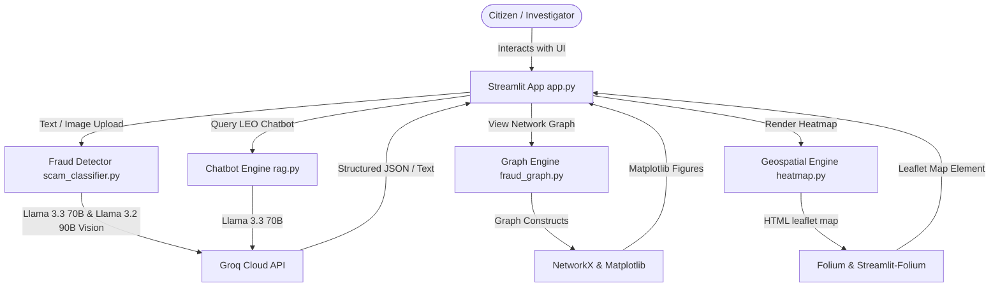

# 🛡️ SentinelAI — Digital Public Safety Intelligence Platform

AI-powered digital public safety platform to detect, visualize, and respond to cyber fraud, digital arrest scams, and financial networks across India.

---

## Overview

**SentinelAI** is an integrated public safety platform designed to assist citizens, banking partners, and law enforcement agencies. By leveraging advanced natural language processing (NLP), large multimodal vision models, graph analytics, and geospatial heatmaps, SentinelAI flags potential online scams, diagrams coordinated cybercrime rings, visualizes national fraud hotspots, and generates operational intelligence reports for cybercrime investigators.

---

## Motivation

India’s digital landscape is undergoing rapid growth, driven by digital payments and mobile networks. However, this has also led to a significant surge in cybercrime:
*   **1.14 Million Cyber Complaints** registered in India in 2023 alone.
*   **Rs 1,776 Crores** lost by victims to "Digital Arrest" and impersonation scams.
*   **60% Year-on-Year Increase** in reported cyber fraud cases.
*   **Investigation Gaps**: Cybercrime cells face massive backlogs. Tracing money-mule accounts, caller phone numbers, and identifying head controllers involves slow manual correlation.

SentinelAI addresses these problems by providing citizens with instant verification tools and equipping investigators with automated link-analysis and LLM-assisted report drafting.

---

## Features

1.  **Citizen Fraud Shield**: A portal for citizens to upload suspicious messages, WhatsApp forwards, or screenshots (SMS, transaction receipts, bank messages). It evaluates the fraud risk score and details recommended immediate actions (e.g., calling 1930, reporting on cybercrime.gov.in).
2.  **Fraud Network Graph**: An intelligence tool that maps relationships between different actors—linking phone numbers, mule bank accounts, victims, and master controllers to visually isolate coordinated fraud rings.
3.  **Geospatial Crime Map**: An interactive map tracking cybercrime incident frequency across India, highlighting hotspots for localized law enforcement patrols.
4.  **Law Enforcement Copilot**: A multi-turn conversational investigator assistant built to query fraud patterns, explain complex digital arrest methodologies, and draft NCRP (National Cyber Crime Reporting Portal) templates.
5.  **Dashboard Analytics**: An operational summary center monitoring national cyber stats, fraud trends, and the platform's overall classification accuracy.

---

## System Architecture

SentinelAI is built as a single-page Streamlit application supported by separate analytical and generative sub-engines.



### End-to-End Data Flow

1.  **Citizen Scam Submission**:
    *   **Text Flow**: The user pastes a scam message. `app.py` passes the string to `fraud_detector/scam_classifier.py:analyze_text()`. It requests a structured JSON back from Groq using **Llama 3.3 70B Versatile**. The result is rendered in the UI with a matching risk color bar (Critical/High/Medium/Low).
    *   **Screenshot Image Flow**: The user uploads an image. `app.py` reads the binary data. `fraud_detector/scam_classifier.py:analyze_image()` base64 encodes it and transmits it to Groq's **Llama 3.2 90B Vision Preview** model. The vision model analyzes the screenshot details directly, returning a structured JSON containing the parsed scam indicators.
2.  **Fraud Ring Graph Resolution**:
    *   `graph_engine/fraud_graph.py:draw_fraud_graph()` constructs a directed graph (`networkx.DiGraph`).
    *   Nodes represent entities: Scammer Phone Numbers, Mule Accounts, Victims, and Controllers. Edges define active relationships: `directs`, `called`, `transferred`, `laundered`.
    *   Matplotlib draws the network using a spring layout against a dark background, which is outputted to the dashboard.
3.  **Hotspot Mapping**:
    *   `geospatial/heatmap.py:generate_heatmap()` loads coordinate pairs representing incident frequency.
    *   A Folium leaflet map is initialized, and an HTML/JS heat layer is overlaid on top of `CartoDB dark_matter` tiles.
    *   Interactive marker circles are mapped to key coordinates (e.g., Delhi, Mumbai) detailing total case metrics and top fraud categories via embedded HTML popup divs.
4.  **Investigator Chatbot**:
    *   Streamlit passes user query text and session conversation history to `chatbot/rag.py:get_copilot_response()`.
    *   The engine formats the prompt history with a system role defining the AI as a cybercrime specialist. It queries Groq using **Llama 3.3 70B Versatile** to output response content.

---

## Folder Structure

```directory
SentinelAI/
│
├── chatbot/                   # Conversational AI investigator modules
│   ├── __init__.py            # Python package initialization
│   └── rag.py                 # Connects to Groq to run the Copilot conversation
│
├── fraud_detector/            # Text and screenshot classification components
│   ├── __init__.py            # Python package initialization
│   └── scam_classifier.py     # Submits messages/images to Groq for JSON analysis
│
├── geospatial/                # Geospatial visualization modules
│   ├── __init__.py            # Python package initialization
│   └── heatmap.py             # Generates Folium maps with localized Indian hotspots
│
├── graph_engine/              # Network graph analytics
│   ├── __init__.py            # Python package initialization
│   └── fraud_graph.py         # Builds NetworkX structures and renders network plots
│
├── data/                      # Placeholder for local datasets (currently empty)
├── docs/                      # Placeholder for documentation (currently empty)
│
├── .env                       # Environment file for secret keys (not committed)
├── .gitignore                 # Specifies files for git version control to ignore
├── app.py                     # Main Streamlit dashboard script and interface styling
├── requirements.txt           # Python library dependencies
├── test_groq.py               # Utility to check Groq API keys and text response speed
└── test_models.py             # Standalone test script validating Google Generative AI
```

---

## Tech Stack

*   **Frontend & Layout**: Streamlit (1.58.0)
*   **Styling**: Custom CSS overrides (Barlow & Barlow Condensed typography, Brutalist design, custom color alerts)
*   **Graph Framework**: NetworkX (3.6.1)
*   **Visualizations**: Matplotlib (3.11.0)
*   **Mapping Library**: Folium (0.20.0), Streamlit-Folium (0.27.2)
*   **Multimodal Inference**: Groq Python SDK (1.5.0)
*   **Environment Manager**: python-dotenv (1.2.2)
*   **Image Processing**: Pillow (12.2.0)

---

## Installation

1.  **Clone the repository**:
    ```bash
    git clone https://github.com/Vanshika-k12/SentinelAI.git
    cd SentinelAI
    ```
2.  Ensure you have **Python 3.8 to 3.11** installed on your system.

---

## Virtual Environment Setup

### On Windows (PowerShell)
```powershell
# Create the virtual environment
python -m venv venv

# Activate the virtual environment
.\venv\Scripts\Activate.ps1

# Install requirements
pip install -r requirements.txt
```

### On macOS / Linux
```bash
# Create the virtual environment
python3 -m venv venv

# Activate the virtual environment
source venv/bin/activate

# Install requirements
pip install -r requirements.txt
```

---

## Environment Variables

The application requires an active API key to connect with Groq Cloud. In the project root folder, create a `.env` file:

```ini
# Required to execute LLM calls for text analysis, vision analysis, and the Copilot
GROQ_API_KEY=your_groq_api_key_here
```

*Note: Do not check `.env` into git repository to avoid leaking credentials.*

---

## Running the Application

To fire up the Streamlit interface locally:
```bash
streamlit run app.py
```
By default, the application will boot and become viewable at `http://localhost:8501`.

---

## Example Usage

### 1. Citizen Fraud Shield (Text Analysis)
*   Navigate to **Citizen Fraud Shield** on the sidebar.
*   Select the **Digital Arrest Scam** from the dropdown examples or copy-paste a message.
*   Click **Analyse for Fraud**.
*   **Result**: The application returns a **Risk Score: 100%**, verdict **SCAM DETECTED**, and lists recommended steps like "DO NOT TRANSFER MONEY. Report at cybercrime.gov.in."

### 2. Law Enforcement Copilot (Investigation Helper)
*   Select **Law Enforcement Copilot** from the sidebar.
*   Click on the **"Generate an NCRP report template for digital arrest scam"** quick-button.
*   **Result**: The assistant responds with a structured legal format for Indian Cyber Crime portal reports.

---

## AI Models & APIs Used

SentinelAI connects directly to the **Groq API Cloud** to carry out prompt-based analytics using the following models:
*   **Llama-3.3-70b-versatile**: Used for textual classification prompts inside `scam_classifier.py` and the conversation engine inside `rag.py`. It is configured with low temperature (`0.0` to `0.3`) to deliver structured JSON outputs and predictable answers.
*   **Llama-3.2-90b-vision-preview**: Used for image uploads inside `scam_classifier.py:analyze_image()`. The model receives base64 image strings to directly perform visual OCR and scam classification in a single API pass.

---

## Limitations

1.  **Static Engine Mockups**: The **Fraud Network Graph** and **Crime Heatmap** populate representations using local python structures. They are not hooked to database clusters or live crime logging APIs.
2.  **No True RAG**: `chatbot/rag.py` is configured as a standalone chat assistant with conversational memory. It does not perform vector-database retrieval or parse external law database PDFs (e.g., IPC/BNS).
3.  **Groq Token Limitations**: Massive image payloads or long text streams uploaded by users might hit request limits or vision-preview rate constraints on free-tier API endpoints.

---

## Future Scope

1.  **Production RAG Database**: Implement a vector database (e.g., ChromaDB or FAISS) to search and extract clauses from the Bhartiya Nyaya Sanhita (BNS) or Indian Penal Code (IPC).
2.  **Real CRM Integration**: Connect maps and network layers directly to standard database query structures (PostgreSQL, Neo4j) containing updated citizen records.
3.  **Local OCR Fallback**: Add a CPU-optimized local OCR engine (such as Tesseract) to extract screenshot text before passing it to LLMs, reducing vision tokens overhead.

---

## Troubleshooting

*   **API Key Error**: If analysis fails with authentication errors, double-check your `GROQ_API_KEY` spelling and make sure your `.env` file is saved in the root folder.
*   **Matplotlib GUI warnings**: Under headless environments, Matplotlib might emit standard logger warnings. The module explicitly runs within Streamlit using non-blocking outputs, so these can be ignored.
*   **Missing Packages**: If imports fail, ensure you activated your virtual environment (`venv`) before running `pip install -r requirements.txt`.

---

## Project Improvements

During the review of this codebase, the following inconsistencies, dead code elements, and configuration discrepancies were identified:

1.  **AI Engine Inconsistencies**:
    *   The main Streamlit interface (`app.py`) features visual tags and markup claiming the app is powered by **"Google Gemini AI"** (e.g., `<span class='tag'>Gemini AI</span>`).
    *   However, the underlying code in `fraud_detector/scam_classifier.py` and `chatbot/rag.py` only implements integrations for **Groq API Cloud** querying **Llama 3.3/3.2** models.
2.  **Dead/Unused Requirements**:
    *   `requirements.txt` installs bulky dependencies such as `easyocr`, `torch`, `torchvision`, `scipy`, and `scikit-image`. These are not imported anywhere in the core application since image analysis is handled via Groq's Vision API.
    *   `google-generativeai` is installed but only imported inside the isolated script `test_models.py`.
3.  **Non-RAG Chatbot File**:
    *   The script `chatbot/rag.py` is named `rag` (Retrieval-Augmented Generation), yet it implements a standard prompt-completion wrapper without any database retrieval mechanisms.
4.  **No Environment Template File**:
    *   The workspace does not provide a `.env.example` file to show new developers the required variables (`GROQ_API_KEY`), which can cause setup confusion.
5.  **Isolated Scripts**:
    *   `test_models.py` is a standalone developer script that tests Gemini model list calls and is not linked to any production execution flows.

---

## Contributors

*   **Vanshika-k12** - Repository Owner & Principal Developer

---

## License

This project is licensed under the MIT License.
